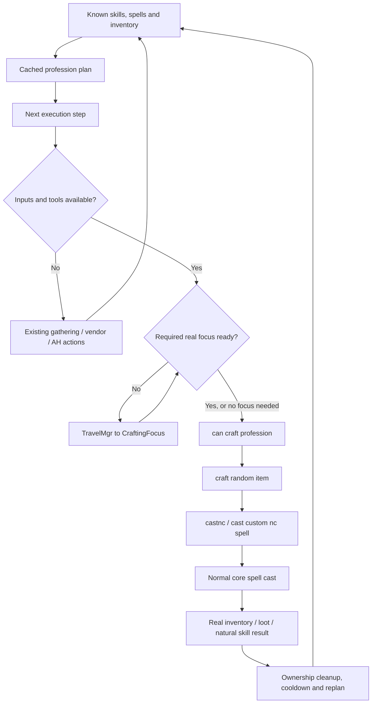

# Architecture

[Wiki home](Home.md) | [Profession pipeline](Profession-Pipeline.md) | [Code reference](Code-Reference.md)

## Responsibility map

| Part | Owns | Does not own |
| --- | --- | --- |
| CMaNGOS data/core | Spell effects, skill rules, items, loot, objects, trainers and transactions | Autonomous profession goal selection |
| Profession planner | Selecting a known skill-up goal and its next bounded production step | Creating output or awarding skill |
| Calculated AI values | Cached recipes, requirements, sources and readiness | Guaranteeing that a cached condition remains true |
| Fairness ledger | Waiting ready skills and bounded goal ownership | Combat/quest action scheduling |
| TravelMgr and travel actions | Destination selection, movement and travel lifecycle | Bypassing spell-focus checks |
| Shared crafting/casting actions | Dispatching the selected spell with real targets and ordinary cast checks | Free reagents or synthetic craft completion |
| Existing economy actions | Vendor purchases, AH transactions, mail and bank item movement | Unlimited money or guaranteed supply |
| Remote-service access | Temporary permission to use personal services without proximity | A replacement economy planner |

## End-to-end route

The AI engine still decides which action gets time. A recipe's numeric score
selects a profession goal; it is not the relevance of an action in the engine.
Combat, movement, ordinary activity and other maintenance can delay crafting.

At this snapshot, named profession gathering/vendor/AH travel requests have base
relevances of 6.975/6.970/6.965. Some normal quest travel requests are lower
(for example 6.84 and 6.3). These are destination-request priorities, not priorities
for the crafting spell itself. Existing targets, allowed/possible/useful checks,
engine state and multipliers still determine actual scheduling; this build does
not guarantee that crafting never competes with quest activity.

## Reusing `rpg craft`

The existing optional `RpgCraftStrategy` bundles three different behaviors:
crafting, random spell casting and random item use. It is excluded from the base
`rpg` toggle. Enabling that bundle is not required for profession progression.

`RpgCraftAction` delegates to the shared `craft random item` action. Autonomous
progression reaches that same action through `MaintenanceStrategy` using
`can craft profession`. The common chat-command strategy routes `castnc` to
`cast custom nc spell`, so this dispatch works independently of `rpg craft`.

For maintenance events, the shared action restricts itself to the selected
profession step. It does not fall through to an unrelated random recipe when
that step is unavailable. Optional RPG crafting can continue to use the shared
action with its broader behavior, subject to pending profession ownership.

## Goal, step and request

These are separate concepts:

| Concept | Example | Lifetime |
| --- | --- | --- |
| Goal | A skill-up item that needs ink | Selected by scoring and fairness |
| Execution step | Mill a real herb stack, or create the required ink | Recomputed from known producers and real inventory |
| Craft request | Snapshot of that step, its input GUID and acceptance state | Owned while dispatch, continuation or processing loot is pending |

An intermediate may be grey and still be useful because it enables a non-grey
goal. Fairness belongs to the root goal's runtime skill, rather than granting a
new unrelated opportunity for every prerequisite.

## State and caches

The selected plan, material sources and recipe/tool values are cached. The
fairness ledger and craft request are separate manual values, so invalidating a
plan does not erase a competing skill's accumulated wait or change an owned
continuation into a new job.

Pending state is per-bot AI state, not a durable economic ledger. Do not assume
it survives destruction of the AI context. Skills and real inventory are ordinary
game state. After a restart, planning uses the state the bot actually has.

Shared metadata indexes avoid scanning all item templates or all processing loot
sources separately for every bot. Cached planning still scans known recipes and
can perform bounded prerequisite exploration; it is not zero-cost. See
[Performance](Code-Reference.md#performance-and-cache-boundaries).

## Training remains an existing path

Trade-trainer selection uses existing trainer metadata, core trainability checks,
travel requests and the `rpg train` action. The profession planner does not grant
the next rank or inject a recipe when no candidate exists. Having no current
skill-up recipe can coexist with a valid independent trainer request.

Remote services do not include trainers. A bot must still have a reachable trainer,
the required level/skill and the money allowed by the existing training policy.
